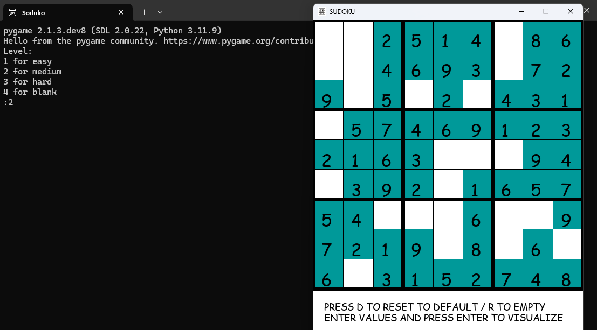

# Sudoku

Welcome to Sudoku, a simple yet engaging Sudoku game implemented in Python using the Pygame library. This project allows you to play Sudoku, solve puzzles, and visualize the solving process. Whether you're a beginner or a seasoned player, Sudoku offers a fun and interactive way to enjoy this classic puzzle game.



## Features

- **Random Puzzle Generation**: Generate random Sudoku puzzles with different difficulty levels (easy, medium, hard, blank).
- **Interactive Gameplay**: Play and solve Sudoku puzzles with a user-friendly interface.
- **Visual Solver**: Visualize the solving process step-by-step.
- **Reset Options**: Reset the puzzle to the default or empty state.
- **Keyboard and Mouse Controls**: Navigate and input values easily.

## Getting Started

### Prerequisites

- Python 3.x
- Pygame library

### Installation

1. Install Python 3.x from [python.org](https://www.python.org/).
2. Install Pygame library using pip:
    ```sh
    pip install pygame
    ```

### How to Play

1. Download the [sudoku.py](http://_vscodecontentref_/1) file and the icon image.
2. Place the icon image in the specified path or update the path in the code.
3. Run the [sudoku.py](http://_vscodecontentref_/2) file:
    ```sh
    python sudoku.py
    ```
4. Use the arrow keys to navigate the grid.
5. Press numbers 1-9 to enter values into the grid.
6. Press `Enter` to start solving the puzzle.
7. Press `R` to reset the puzzle to an empty state.
8. Press `D` to reset the puzzle to the default state.

### Example Code Snippet

```python
import pygame
import random

pygame.font.init()
screen = pygame.display.set_mode((500, 600))
pygame.display.set_caption("SUDOKU")
img = pygame.image.load('C:\\Users\\HP\\Downloads\\icon.jpg')
pygame.display.set_icon(img)

# Initial Sudoku grid
a = [4, 8, 6, 5, 3, 7, 2, 9, 1]
b = [1, 9, 7, 8, 2, 6, 3, 5, 4]
c = [5, 3, 2, 9, 4, 1, 8, 6, 7]
d = [3, 1, 9, 6, 7, 5, 4, 2, 8]
e = [2, 6, 8, 4, 1, 3, 5, 7, 9]
f = [7, 5, 4, 2, 8, 9, 6, 1, 3]
g = [9, 4, 5, 1, 6, 8, 7, 3, 2]
h = [6, 2, 3, 7, 9, 4, 1, 8, 5]
i = [8, 7, 1, 3, 5, 2, 9, 4, 6]

# Randomize the grid
q = []
for j in range(random.randint(0, 20)):
    a1 = random.randint(1, 9)
    b1 = random.randint(1, 9)
    if a1 != b1 and a1 not in q and b1 not in q:
        for k in [a, b, c, d, e, f, g, h, i]:
            for l in range(9):
                if k[l] == a1:
                    k[l] = b1
                elif k[l] == b1:
                    k[l] = a1
```


### Acknowledgements
Inspired by the classic Sudoku puzzle.
Special thanks to the Python community.
Enjoy playing Sudoku!